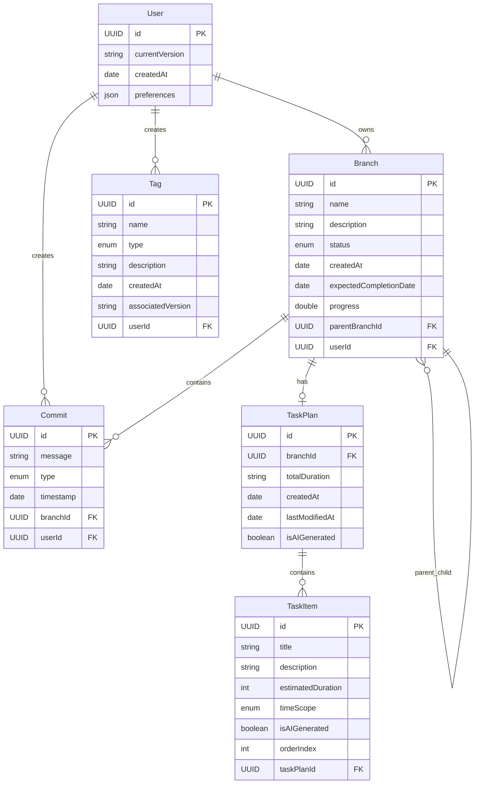

# Design Document

## Overview

人生Git是一款基于SwiftUI的iOS原生应用，将Git版本控制的概念创新性地应用到个人目标管理中。应用采用现代iOS开发最佳实践，包括SwiftUI声明式UI、MVVM架构模式、SwiftData数据持久化，以及符合Apple人机界面指引的设计语言。

**技术要求**: 应用支持iOS 16.0及以上版本，充分利用最新的SwiftUI和SwiftData特性，确保在iPhone全系列设备上的最佳性能表现。

**MVP优先设计**: 设计采用MVP优先的方法，首先实现核心功能（分支管理、基础提交、AI任务拆解、本地存储），然后逐步扩展到高级功能。

核心设计理念是将复杂的目标管理系统通过熟悉的Git概念进行简化，让用户能够直观地理解和操作他们的人生目标，同时通过AI辅助任务拆解提供智能化的目标规划体验。

## Architecture

### 整体架构模式

应用采用MVVM (Model-View-ViewModel) 架构模式，结合SwiftUI的声明式特性：

```
┌─────────────────┐    ┌─────────────────┐    ┌─────────────────┐
│      View       │◄──►│   ViewModel     │◄──►│     Model       │
│   (SwiftUI)     │    │ (ObservableObject)│    │  (SwiftData)    │
└─────────────────┘    └─────────────────┘    └─────────────────┘
         │                       │                       │
         │                       │                       │
         ▼                       ▼                       ▼
┌─────────────────┐    ┌─────────────────┐    ┌─────────────────┐
│  UI Components  │    │  Business Logic │    │  Data Services  │
│   Navigation    │    │   State Mgmt    │    │   Persistence   │
│   Animations    │    │   AI Integration│    │   Sync Logic    │
└─────────────────┘    └─────────────────┘    └─────────────────┘
```

### 核心架构组件

1. **Presentation Layer (SwiftUI Views)**
   - 主干视图 (MasterBranchView)
   - 分支列表视图 (BranchListView)
   - 分支详情视图 (BranchDetailView)
   - 提交历史视图 (CommitHistoryView)
   - 统计分析视图 (AnalyticsView)

2. **Business Logic Layer (ViewModels)**
   - 应用状态管理 (AppStateManager)
   - 分支管理器 (BranchManager)
   - 提交管理器 (CommitManager)
   - AI助手服务 (AIAssistantService)

3. **Data Layer (Models & Services)**
   - SwiftData模型定义
   - 数据访问层 (Repository Pattern)
   - 本地存储服务
   - iCloud同步服务

## Components and Interfaces

### 1. 数据模型层

#### 核心数据模型

```swift
// 用户模型
@Model
class User {
    @Attribute(.unique) var id: UUID
    var currentVersion: String
    var createdAt: Date
    var preferences: UserPreferences
    
    @Relationship(deleteRule: .cascade) var branches: [Branch]
    @Relationship(deleteRule: .cascade) var commits: [Commit]
    @Relationship(deleteRule: .cascade) var tags: [Tag]
}

// 分支模型
@Model
class Branch {
    @Attribute(.unique) var id: UUID
    var name: String
    var description: String
    var status: BranchStatus // .active, .completed, .abandoned
    var createdAt: Date
    var expectedCompletionDate: Date?
    var progress: Double // 0.0 - 1.0
    var parentBranchId: UUID? // 通常是master
    
    @Relationship(deleteRule: .cascade) var commits: [Commit]
    @Relationship(deleteRule: .cascade) var taskPlan: TaskPlan?
    // 完整版本功能
    // @Relationship(deleteRule: .cascade) var schedulePlan: SchedulePlan?
    @Relationship(inverse: \User.branches) var user: User?
}

// 提交模型
@Model
class Commit {
    @Attribute(.unique) var id: UUID
    var message: String
    var type: CommitType // .taskComplete, .learning, .reflection, .milestone
    var timestamp: Date
    var branchId: UUID
    var relatedTaskId: UUID?
    
    @Relationship(inverse: \Branch.commits) var branch: Branch?
    @Relationship(inverse: \User.commits) var user: User?
}

// 任务计划模型
@Model
class TaskPlan {
    @Attribute(.unique) var id: UUID
    var branchId: UUID
    var totalDuration: String // 预计总时长描述
    var createdAt: Date
    var lastModifiedAt: Date?
    var isAIGenerated: Bool
    
    @Relationship(deleteRule: .cascade) var tasks: [TaskItem]
    
    init(id: UUID, branchId: UUID, tasks: [TaskItem], totalDuration: String, 
         createdAt: Date = Date(), isAIGenerated: Bool = false) {
        self.id = id
        self.branchId = branchId
        self.tasks = tasks
        self.totalDuration = totalDuration
        self.createdAt = createdAt
        self.isAIGenerated = isAIGenerated
    }
}

// 任务项模型
@Model
class TaskItem {
    @Attribute(.unique) var id: UUID
    var title: String
    var description: String
    var estimatedDuration: Int // 预估时长（分钟）
    var timeScope: TaskTimeScope // 时间维度：日、周、月
    var isAIGenerated: Bool // 是否由AI生成
    var orderIndex: Int // 任务顺序
    
    @Relationship(inverse: \TaskPlan.tasks) var taskPlan: TaskPlan?
    
    init(id: UUID, title: String, description: String, estimatedDuration: Int,
         timeScope: TaskTimeScope, isAIGenerated: Bool, orderIndex: Int) {
        self.id = id
        self.title = title
        self.description = description
        self.estimatedDuration = estimatedDuration
        self.timeScope = timeScope
        self.isAIGenerated = isAIGenerated
        self.orderIndex = orderIndex
    }
}

// 日程计划模型
@Model
class SchedulePlan {
    @Attribute(.unique) var id: UUID
    var taskPlanId: UUID
    var startDate: Date
    var createdAt: Date
    var lastModifiedAt: Date?
    
    @Relationship(deleteRule: .cascade) var scheduleItems: [ScheduleItem]
    
    init(id: UUID, taskPlanId: UUID, scheduleItems: [ScheduleItem], 
         startDate: Date, createdAt: Date = Date()) {
        self.id = id
        self.taskPlanId = taskPlanId
        self.scheduleItems = scheduleItems
        self.startDate = startDate
        self.createdAt = createdAt
    }
}

// 日程项模型
@Model
class ScheduleItem {
    @Attribute(.unique) var id: UUID
    var taskId: UUID // 关联的任务项ID
    var title: String
    var description: String
    var scheduledDate: Date // 计划执行日期
    var scheduledTime: Date // 计划执行时间
    var duration: Int // 持续时间（分钟）
    var timeScope: TaskTimeScope
    var isCompleted: Bool
    var completedAt: Date?
    var lastModifiedAt: Date?
    
    @Relationship(inverse: \SchedulePlan.scheduleItems) var schedulePlan: SchedulePlan?
    
    init(id: UUID, taskId: UUID, title: String, description: String,
         scheduledDate: Date, scheduledTime: Date, duration: Int, 
         timeScope: TaskTimeScope, isCompleted: Bool = false) {
        self.id = id
        self.taskId = taskId
        self.title = title
        self.description = description
        self.scheduledDate = scheduledDate
        self.scheduledTime = scheduledTime
        self.duration = duration
        self.timeScope = timeScope
        self.isCompleted = isCompleted
    }
}

// 任务时间维度
enum TaskTimeScope: String, CaseIterable, Codable {
    case daily = "daily"     // 日任务
    case weekly = "weekly"   // 周任务
    case monthly = "monthly" // 月任务
    
    var displayName: String {
        switch self {
        case .daily: return "每日任务"
        case .weekly: return "每周任务"
        case .monthly: return "每月任务"
        }
    }
}

// 标签模型
@Model
class Tag {
    @Attribute(.unique) var id: UUID
    var name: String
    var type: TagType // .milestone, .birthday, .career, .relationship, .education, .achievement
    var description: String
    var createdAt: Date
    var associatedVersion: String?
    
    @Relationship(inverse: \User.tags) var user: User?
}
```

#### 枚举定义

```swift
enum BranchStatus: String, CaseIterable, Codable {
    case active = "active"
    case completed = "completed"
    case abandoned = "abandoned"
    
    var emoji: String {
        switch self {
        case .active: return "🔵"
        case .completed: return "✅"
        case .abandoned: return "❌"
        }
    }
}

enum CommitType: String, CaseIterable, Codable {
    case taskComplete = "task_complete"
    case learning = "learning"
    case reflection = "reflection"
    case milestone = "milestone"
    
    var emoji: String {
        switch self {
        case .taskComplete: return "✅"
        case .learning: return "📚"
        case .reflection: return "🌟"
        case .milestone: return "🏆"
        }
    }
}

enum TagType: String, CaseIterable, Codable {
    case milestone = "milestone"
    case birthday = "birthday"
    case career = "career"
    case relationship = "relationship"
    case education = "education"
    case achievement = "achievement"
    
    var emoji: String {
        switch self {
        case .milestone: return "🎯"
        case .birthday: return "🎂"
        case .career: return "💼"
        case .relationship: return "💑"
        case .education: return "🎓"
        case .achievement: return "🏆"
        }
    }
}
```

### 2. 业务逻辑层

#### 应用状态管理器

```swift
@MainActor
class AppStateManager: ObservableObject {
    @Published var currentBranch: Branch?
    @Published var isShowingBranchList = false
    @Published var selectedCommitFilter: CommitType?
    @Published var homePagePreference: HomePagePreference = .smart
    
    private let branchManager: BranchManager
    private let commitManager: CommitManager
    private let aiAssistant: AIAssistantService
    
    func switchToBranch(_ branch: Branch) {
        currentBranch = branch
        // 保存用户偏好
        UserDefaults.standard.set(branch.id.uuidString, forKey: "lastActiveBranch")
    }
    
    func determineHomePage() -> Branch? {
        switch homePagePreference {
        case .smart:
            return smartHomePageLogic()
        case .lastViewed:
            return getLastViewedBranch()
        case .alwaysMaster:
            return getMasterBranch()
        case .mostActive:
            return getMostActiveBranch()
        }
    }
    
    private func smartHomePageLogic() -> Branch? {
        let activeBranches = branchManager.getActiveBranches()
        if activeBranches.isEmpty {
            return getMasterBranch()
        }
        return activeBranches.max(by: { $0.commits.count < $1.commits.count })
    }
}
```

#### 分支管理器

```swift
@MainActor
class BranchManager: ObservableObject {
    @Published var branches: [Branch] = []
    
    private let repository: BranchRepository
    private let taskPlanService: TaskPlanService
    // 完整版本功能
    // private let schedulePlanService: SchedulePlanService
    
    func createBranch(name: String, description: String) async throws -> Branch {
        let branch = Branch(
            id: UUID(),
            name: name,
            description: description,
            status: .active,
            createdAt: Date(),
            progress: 0.0
        )
        
        // AI生成任务计划（MVP版本）
        let taskPlan = try await taskPlanService.generateTaskPlan(for: branch)
        branch.taskPlan = taskPlan
        
        // 生成日程计划（完整版本功能）
        // let schedulePlan = schedulePlanService.generateSchedule(from: taskPlan)
        // branch.schedulePlan = schedulePlan
        
        try await repository.save(branch)
        branches.append(branch)
        
        return branch
    }
    
    func mergeBranch(_ branch: Branch) async throws {
        branch.status = .completed
        
        // 生成AI复盘报告
        let review = try await aiAssistant.generateReview(for: branch)
        
        // 创建合并提交到主干
        let mergeCommit = Commit(
            id: UUID(),
            message: "Merge branch '\(branch.name)' - \(review.summary)",
            type: .milestone,
            timestamp: Date(),
            branchId: getMasterBranch().id
        )
        
        try await repository.save(branch)
        try await repository.save(mergeCommit)
        
        // 检查是否需要版本升级
        if branch.isImportantGoal {
            try await upgradeVersion()
        }
    }
    
    func getActiveBranches() -> [Branch] {
        return branches.filter { $0.status == .active }
    }
    
    func getMasterBranch() -> Branch {
        return branches.first { $0.name == "master" } ?? createMasterBranch()
    }
}
```

#### 任务计划服务

```swift
// 任务计划服务 - 负责AI交互和任务计划管理
class TaskPlanService {
    private let deepseekClient: DeepseekR1Client
    
    func generateTaskPlan(for branch: Branch) async throws -> TaskPlan {
        let prompt = """
        我想要实现以下目标，请帮我制定一个详细的任务计划：
        
        目标: \(branch.name)
        描述: \(branch.description)
        
        请按照以下格式返回JSON结构的任务计划：
        {
          "totalDuration": "预计总时长（如：3周）",
          "tasks": [
            {
              "title": "任务名称",
              "description": "详细描述",
              "estimatedDuration": 20,
              "suggestedDate": "2024-01-15",
              "timeScope": "daily",
              "orderIndex": 1
            }
          ]
        }
        
        要求：
        1. 根据目标复杂度生成合适数量的任务
        2. 任务可以按日、周、月的维度组织
        3. 每个任务包含具体的执行建议
        4. 任务之间有合理的时间安排
        """
        
        let response = try await deepseekClient.generateCompletion(prompt: prompt)
        return parseTaskPlanFromResponse(response, branchId: branch.id)
    }
    
    private func parseTaskPlanFromResponse(_ response: String, branchId: UUID) -> TaskPlan {
        // 解析AI返回的JSON格式任务计划
        guard let data = response.data(using: .utf8),
              let planResponse = try? JSONDecoder().decode(TaskPlanResponse.self, from: data) else {
            return TaskPlan(id: UUID(), branchId: branchId, tasks: [], totalDuration: "未知")
        }
        
        let tasks = planResponse.tasks.map { taskData in
            TaskItem(
                id: UUID(),
                title: taskData.title,
                description: taskData.description,
                estimatedDuration: taskData.estimatedDuration,
                timeScope: TaskTimeScope(rawValue: taskData.timeScope) ?? .daily,
                isAIGenerated: true,
                orderIndex: taskData.orderIndex
            )
        }
        
        return TaskPlan(
            id: UUID(),
            branchId: branchId,
            tasks: tasks,
            totalDuration: planResponse.totalDuration,
            createdAt: Date(),
            isAIGenerated: true
        )
    }
    
    func updateTaskPlan(_ taskPlan: TaskPlan, with userModifications: [TaskItem]) -> TaskPlan {
        // 用户手工修改任务计划
        var updatedPlan = taskPlan
        updatedPlan.tasks = userModifications
        updatedPlan.lastModifiedAt = Date()
        return updatedPlan
    }
}

// 日程计划服务 - 根据任务计划生成具体的日程安排（完整版本功能）
class SchedulePlanService {
    
    func generateSchedule(from taskPlan: TaskPlan, startDate: Date = Date()) -> SchedulePlan {
        var scheduleItems: [ScheduleItem] = []
        var currentDate = startDate
        
        for task in taskPlan.tasks.sorted(by: { $0.orderIndex < $1.orderIndex }) {
            let scheduleItem = createScheduleItem(from: task, on: currentDate)
            scheduleItems.append(scheduleItem)
            
            // 根据任务时间维度计算下一个任务的开始时间
            currentDate = calculateNextTaskDate(from: currentDate, timeScope: task.timeScope)
        }
        
        return SchedulePlan(
            id: UUID(),
            taskPlanId: taskPlan.id,
            scheduleItems: scheduleItems,
            startDate: startDate,
            createdAt: Date()
        )
    }
    
    private func createScheduleItem(from task: TaskItem, on date: Date) -> ScheduleItem {
        // 根据任务时间维度确定具体的执行时间
        let scheduledTime = determineScheduledTime(for: task, on: date)
        
        return ScheduleItem(
            id: UUID(),
            taskId: task.id,
            title: task.title,
            description: task.description,
            scheduledDate: date,
            scheduledTime: scheduledTime,
            duration: task.estimatedDuration,
            timeScope: task.timeScope,
            isCompleted: false
        )
    }
    
    private func determineScheduledTime(for task: TaskItem, on date: Date) -> Date {
        let calendar = Calendar.current
        
        switch task.timeScope {
        case .daily:
            // 每日任务默认安排在上午9点
            return calendar.date(bySettingHour: 9, minute: 0, second: 0, of: date) ?? date
        case .weekly:
            // 每周任务安排在周一上午10点
            let weekday = calendar.component(.weekday, from: date)
            let daysToMonday = (2 - weekday + 7) % 7
            let mondayDate = calendar.date(byAdding: .day, value: daysToMonday, to: date) ?? date
            return calendar.date(bySettingHour: 10, minute: 0, second: 0, of: mondayDate) ?? date
        case .monthly:
            // 每月任务安排在月初第一个工作日上午11点
            let firstDayOfMonth = calendar.date(from: calendar.dateComponents([.year, .month], from: date)) ?? date
            return calendar.date(bySettingHour: 11, minute: 0, second: 0, of: firstDayOfMonth) ?? date
        }
    }
    
    private func calculateNextTaskDate(from currentDate: Date, timeScope: TaskTimeScope) -> Date {
        let calendar = Calendar.current
        
        switch timeScope {
        case .daily:
            return calendar.date(byAdding: .day, value: 1, to: currentDate) ?? currentDate
        case .weekly:
            return calendar.date(byAdding: .weekOfYear, value: 1, to: currentDate) ?? currentDate
        case .monthly:
            return calendar.date(byAdding: .month, value: 1, to: currentDate) ?? currentDate
        }
    }
    
    func updateScheduleItem(_ item: ScheduleItem, newDate: Date, newTime: Date) -> ScheduleItem {
        // 用户手工调整日程安排
        var updatedItem = item
        updatedItem.scheduledDate = newDate
        updatedItem.scheduledTime = newTime
        updatedItem.lastModifiedAt = Date()
        return updatedItem
    }
}

// Deepseek-R1 API客户端
class DeepseekR1Client {
    private let apiKey: String
    private let baseURL = "https://api.deepseek.com/v1"
    
    init(apiKey: String) {
        self.apiKey = apiKey
    }
    
    func generateCompletion(prompt: String) async throws -> String {
        let url = URL(string: "\(baseURL)/chat/completions")!
        var request = URLRequest(url: url)
        request.httpMethod = "POST"
        request.setValue("Bearer \(apiKey)", forHTTPHeaderField: "Authorization")
        request.setValue("application/json", forHTTPHeaderField: "Content-Type")
        
        let requestBody = DeepseekRequest(
            model: "deepseek-r1",
            messages: [
                DeepseekMessage(role: "user", content: prompt)
            ],
            temperature: 0.7,
            max_tokens: 2000
        )
        
        request.httpBody = try JSONEncoder().encode(requestBody)
        
        let (data, _) = try await URLSession.shared.data(for: request)
        let response = try JSONDecoder().decode(DeepseekResponse.self, from: data)
        
        return response.choices.first?.message.content ?? ""
    }
}

// Deepseek API数据结构
struct DeepseekRequest: Codable {
    let model: String
    let messages: [DeepseekMessage]
    let temperature: Double
    let max_tokens: Int
}

struct DeepseekMessage: Codable {
    let role: String
    let content: String
}

struct DeepseekResponse: Codable {
    let choices: [DeepseekChoice]
}

struct DeepseekChoice: Codable {
    let message: DeepseekMessage
}

// 任务计划响应结构
struct TaskPlanResponse: Codable {
    let totalDuration: String
    let tasks: [TaskData]
}

struct TaskData: Codable {
    let title: String
    let description: String
    let estimatedDuration: Int // 分钟
    let timeScope: String
    let orderIndex: Int
}

// 完整版本功能：分支复盘
extension AIAssistantService {
    func generateReview(for branch: Branch) async throws -> BranchReview {
        let commits = branch.commits.sorted { $0.timestamp < $1.timestamp }
        let timeSpent = branch.createdAt.distance(to: Date())
        
        let prompt = """
        分支名称: \(branch.name)
        创建时间: \(branch.createdAt)
        完成时间: \(Date())
        总提交数: \(commits.count)
        
        提交历史:
        \(commits.map { "- \($0.type.emoji) \($0.message)" }.joined(separator: "\n"))
        
        请生成一份复盘报告，包含：
        1. 目标达成情况分析
        2. 时间效率评估
        3. 关键成功因素
        4. 改进建议
        5. 下一步建议
        """
        
        let response = try await deepseekClient.generateCompletion(prompt: prompt)
        return BranchReview(content: response, branch: branch)
    }
    
    func generateProgressSuggestion(for branch: Branch) async throws -> String {
        // 根据分支当前状态生成进度建议
        let recentCommits = branch.commits.suffix(5)
        let completedTasks = branch.tasks.filter { $0.isCompleted }
        
        let prompt = """
        当前目标: \(branch.name)
        进度: \(Int(branch.progress * 100))%
        已完成任务: \(completedTasks.count)/\(branch.tasks.count)
        
        最近提交:
        \(recentCommits.map { "- \($0.message)" }.joined(separator: "\n"))
        
        请提供具体的进度优化建议。
        """
        
        return try await apiClient.generateCompletion(prompt: prompt)
    }
}
```

### 3. 用户界面层

#### 主要视图组件

```swift
// 主应用视图
struct ContentView: View {
    @StateObject private var appState = AppStateManager()
    @State private var selectedTab = 0
    
    var body: some View {
        TabView(selection: $selectedTab) {
            NavigationStack {
                if let currentBranch = appState.currentBranch {
                    BranchDetailView(branch: currentBranch)
                } else {
                    MasterBranchView()
                }
            }
            .tabItem {
                Image(systemName: "git.branch")
                Text("分支")
            }
            .tag(0)
            
            BranchListView()
                .tabItem {
                    Image(systemName: "list.bullet")
                    Text("列表")
                }
                .tag(1)
            
            AnalyticsView()
                .tabItem {
                    Image(systemName: "chart.bar")
                    Text("统计")
                }
                .tag(2)
            
            SettingsView()
                .tabItem {
                    Image(systemName: "gear")
                    Text("设置")
                }
                .tag(3)
        }
        .environmentObject(appState)
    }
}

// 分支切换器组件
struct BranchSwitcher: View {
    @EnvironmentObject var appState: AppStateManager
    @StateObject private var branchManager = BranchManager()
    
    var body: some View {
        Menu {
            Button("主干 (Master)") {
                appState.switchToBranch(branchManager.getMasterBranch())
            }
            
            Divider()
            
            ForEach(branchManager.getActiveBranches()) { branch in
                Button(action: {
                    appState.switchToBranch(branch)
                }) {
                    HStack {
                        Text(branch.status.emoji)
                        Text(branch.name)
                        Spacer()
                        Text("\(Int(branch.progress * 100))%")
                            .font(.caption)
                            .foregroundColor(.secondary)
                    }
                }
            }
        } label: {
            HStack {
                Text(appState.currentBranch?.name ?? "Master")
                    .font(.headline)
                Image(systemName: "chevron.down")
                    .font(.caption)
            }
            .padding(.horizontal)
            .padding(.vertical, 8)
            .background(Color.secondary.opacity(0.1))
            .cornerRadius(8)
        }
    }
}

// 提交时间线视图
struct CommitTimelineView: View {
    let commits: [Commit]
    @State private var selectedFilter: CommitType?
    
    var filteredCommits: [Commit] {
        if let filter = selectedFilter {
            return commits.filter { $0.type == filter }
        }
        return commits
    }
    
    var body: some View {
        VStack(alignment: .leading) {
            // 过滤器
            ScrollView(.horizontal, showsIndicators: false) {
                HStack {
                    FilterChip(title: "全部", isSelected: selectedFilter == nil) {
                        selectedFilter = nil
                    }
                    
                    ForEach(CommitType.allCases, id: \.self) { type in
                        FilterChip(
                            title: "\(type.emoji) \(type.rawValue)",
                            isSelected: selectedFilter == type
                        ) {
                            selectedFilter = type
                        }
                    }
                }
                .padding(.horizontal)
            }
            
            // 时间线
            LazyVStack(alignment: .leading, spacing: 16) {
                ForEach(filteredCommits.sorted { $0.timestamp > $1.timestamp }) { commit in
                    CommitRowView(commit: commit)
                }
            }
            .padding()
        }
    }
}

// 提交行视图
struct CommitRowView: View {
    let commit: Commit
    
    var body: some View {
        HStack(alignment: .top, spacing: 12) {
            // 类型图标
            ZStack {
                Circle()
                    .fill(commit.type.color)
                    .frame(width: 32, height: 32)
                
                Text(commit.type.emoji)
                    .font(.system(size: 16))
            }
            
            VStack(alignment: .leading, spacing: 4) {
                Text(commit.message)
                    .font(.body)
                    .foregroundColor(.primary)
                
                Text(commit.timestamp.formatted(.relative(presentation: .named)))
                    .font(.caption)
                    .foregroundColor(.secondary)
            }
            
            Spacer()
        }
        .padding(.vertical, 4)
    }
}

// 任务计划视图
struct TaskPlanView: View {
    let branch: Branch
    @StateObject private var taskPlanManager = TaskPlanManager()
    @State private var isRegeneratingPlan = false
    @State private var isEditingPlan = false
    
    var body: some View {
        VStack(alignment: .leading, spacing: 16) {
            // 标题和操作按钮
            HStack {
                Text("任务计划")
                    .font(.headline)
                
                Spacer()
                
                Button("编辑") {
                    isEditingPlan = true
                }
                
                Button("重新生成") {
                    Task {
                        isRegeneratingPlan = true
                        await taskPlanManager.regenerateTaskPlan(for: branch)
                        isRegeneratingPlan = false
                    }
                }
                .disabled(isRegeneratingPlan)
            }
            
            // 任务列表
            if let taskPlan = branch.taskPlan {
                LazyVStack(spacing: 12) {
                    ForEach(taskPlan.tasks.sorted { $0.orderIndex < $1.orderIndex }) { task in
                        TaskItemRowView(task: task, isEditing: isEditingPlan)
                    }
                }
            } else {
                Text("暂无任务计划")
                    .foregroundColor(.secondary)
            }
        }
        .padding()
        .sheet(isPresented: $isEditingPlan) {
            TaskPlanEditView(taskPlan: branch.taskPlan) { updatedPlan in
                branch.taskPlan = updatedPlan
            }
        }
    }
}

// 日程计划视图（完整版本功能）
struct SchedulePlanView: View {
    let branch: Branch
    @StateObject private var schedulePlanManager = SchedulePlanManager()
    @State private var selectedDate = Date()
    
    var body: some View {
        VStack(alignment: .leading, spacing: 16) {
            // 标题
            HStack {
                Text("日程安排")
                    .font(.headline)
                
                Spacer()
                
                Button("生成日程") {
                    Task {
                        await schedulePlanManager.generateSchedule(for: branch)
                    }
                }
            }
            
            // 日期选择器
            DatePicker("选择日期", selection: $selectedDate, displayedComponents: .date)
                .datePickerStyle(.compact)
            
            // 当日日程列表
            if let schedulePlan = branch.schedulePlan {
                let todayItems = schedulePlan.scheduleItems.filter { 
                    Calendar.current.isDate($0.scheduledDate, inSameDayAs: selectedDate)
                }
                
                LazyVStack(spacing: 12) {
                    ForEach(todayItems.sorted { $0.scheduledTime < $1.scheduledTime }) { item in
                        ScheduleItemRowView(item: item)
                    }
                }
            } else {
                Text("暂无日程安排")
                    .foregroundColor(.secondary)
            }
        }
        .padding()
    }
}

// 任务项行视图
struct TaskItemRowView: View {
    @ObservedObject var task: TaskItem
    let isEditing: Bool
    
    var body: some View {
        HStack(alignment: .top, spacing: 12) {
            VStack(alignment: .leading, spacing: 4) {
                Text(task.title)
                    .font(.body)
                    .foregroundColor(.primary)
                
                Text(task.description)
                    .font(.caption)
                    .foregroundColor(.secondary)
                    .lineLimit(2)
                
                HStack {
                    // 时间维度标签
                    Text(task.timeScope.displayName)
                        .font(.caption2)
                        .padding(.horizontal, 6)
                        .padding(.vertical, 2)
                        .background(Color.blue.opacity(0.1))
                        .foregroundColor(.blue)
                        .cornerRadius(4)
                    
                    // 预估时长
                    Text("\(task.estimatedDuration)分钟")
                        .font(.caption2)
                        .foregroundColor(.secondary)
                    
                    Spacer()
                    
                    // AI生成标识
                    if task.isAIGenerated {
                        Image(systemName: "sparkles")
                            .font(.caption2)
                            .foregroundColor(.purple)
                    }
                }
            }
            
            Spacer()
            
            // 编辑模式下显示操作按钮
            if isEditing {
                VStack {
                    Button(action: {
                        // 编辑任务
                    }) {
                        Image(systemName: "pencil")
                            .foregroundColor(.blue)
                    }
                    
                    Button(action: {
                        // 删除任务
                    }) {
                        Image(systemName: "trash")
                            .foregroundColor(.red)
                    }
                }
            }
        }
        .padding(.vertical, 4)
    }
}

// 日程项行视图
struct ScheduleItemRowView: View {
    @ObservedObject var item: ScheduleItem
    
    var body: some View {
        HStack(alignment: .top, spacing: 12) {
            // 完成状态
            Button(action: {
                item.isCompleted.toggle()
                if item.isCompleted {
                    item.completedAt = Date()
                } else {
                    item.completedAt = nil
                }
            }) {
                Image(systemName: item.isCompleted ? "checkmark.circle.fill" : "circle")
                    .foregroundColor(item.isCompleted ? .green : .gray)
                    .font(.title2)
            }
            
            VStack(alignment: .leading, spacing: 4) {
                Text(item.title)
                    .font(.body)
                    .strikethrough(item.isCompleted)
                    .foregroundColor(item.isCompleted ? .secondary : .primary)
                
                Text(item.description)
                    .font(.caption)
                    .foregroundColor(.secondary)
                    .lineLimit(2)
                
                HStack {
                    // 计划时间
                    Text(item.scheduledTime.formatted(date: .omitted, time: .shortened))
                        .font(.caption2)
                        .padding(.horizontal, 6)
                        .padding(.vertical, 2)
                        .background(Color.orange.opacity(0.1))
                        .foregroundColor(.orange)
                        .cornerRadius(4)
                    
                    // 持续时间
                    Text("\(item.duration)分钟")
                        .font(.caption2)
                        .foregroundColor(.secondary)
                    
                    Spacer()
                    
                    // 时间维度标识
                    Text(item.timeScope.displayName)
                        .font(.caption2)
                        .foregroundColor(.blue)
                }
            }
            
            Spacer()
        }
        .padding(.vertical, 4)
    }
}

// 任务计划管理器
@MainActor
class TaskPlanManager: ObservableObject {
    private let taskPlanService: TaskPlanService
    private let repository: TaskPlanRepository
    
    init(taskPlanService: TaskPlanService = TaskPlanService(), 
         repository: TaskPlanRepository = SwiftDataTaskPlanRepository()) {
        self.taskPlanService = taskPlanService
        self.repository = repository
    }
    
    func regenerateTaskPlan(for branch: Branch) async {
        do {
            // 删除现有的任务计划
            if let existingPlan = branch.taskPlan {
                try await repository.delete(existingPlan)
            }
            
            // 生成新的任务计划
            let newTaskPlan = try await taskPlanService.generateTaskPlan(for: branch)
            try await repository.save(newTaskPlan)
            
            // 更新分支的任务计划
            branch.taskPlan = newTaskPlan
        } catch {
            print("重新生成任务计划失败: \(error)")
        }
    }
    
    func updateTaskPlan(_ taskPlan: TaskPlan, with modifications: [TaskItem]) async {
        let updatedPlan = taskPlanService.updateTaskPlan(taskPlan, with: modifications)
        
        do {
            try await repository.save(updatedPlan)
        } catch {
            print("更新任务计划失败: \(error)")
        }
    }
}

// 日程计划管理器（完整版本功能）
@MainActor
class SchedulePlanManager: ObservableObject {
    private let schedulePlanService: SchedulePlanService
    private let repository: SchedulePlanRepository
    
    init(schedulePlanService: SchedulePlanService = SchedulePlanService(),
         repository: SchedulePlanRepository = SwiftDataSchedulePlanRepository()) {
        self.schedulePlanService = schedulePlanService
        self.repository = repository
    }
    
    func generateSchedule(for branch: Branch) async {
        guard let taskPlan = branch.taskPlan else { return }
        
        do {
            // 删除现有的日程计划
            if let existingSchedule = branch.schedulePlan {
                try await repository.delete(existingSchedule)
            }
            
            // 生成新的日程计划
            let newSchedulePlan = schedulePlanService.generateSchedule(from: taskPlan)
            try await repository.save(newSchedulePlan)
            
            // 更新分支的日程计划
            branch.schedulePlan = newSchedulePlan
        } catch {
            print("生成日程计划失败: \(error)")
        }
    }
    
    func updateScheduleItem(_ item: ScheduleItem, newDate: Date, newTime: Date) async {
        let updatedItem = schedulePlanService.updateScheduleItem(item, newDate: newDate, newTime: newTime)
        
        do {
            try await repository.saveScheduleItem(updatedItem)
        } catch {
            print("更新日程项失败: \(error)")
        }
    }
    
    func completeScheduleItem(_ item: ScheduleItem) async {
        item.isCompleted = true
        item.completedAt = Date()
        
        do {
            try await repository.saveScheduleItem(item)
        } catch {
            print("保存日程项状态失败: \(error)")
        }
    }
}

// 任务计划仓库协议
protocol TaskPlanRepository {
    func save(_ taskPlan: TaskPlan) async throws
    func delete(_ taskPlan: TaskPlan) async throws
    func fetchTaskPlanForBranch(_ branchId: UUID) async throws -> TaskPlan?
}

class SwiftDataTaskPlanRepository: TaskPlanRepository {
    private let modelContext: ModelContext
    
    init(modelContext: ModelContext = ModelContext.shared) {
        self.modelContext = modelContext
    }
    
    func save(_ taskPlan: TaskPlan) async throws {
        modelContext.insert(taskPlan)
        try modelContext.save()
    }
    
    func delete(_ taskPlan: TaskPlan) async throws {
        modelContext.delete(taskPlan)
        try modelContext.save()
    }
    
    func fetchTaskPlanForBranch(_ branchId: UUID) async throws -> TaskPlan? {
        let descriptor = FetchDescriptor<TaskPlan>(
            predicate: #Predicate { $0.branchId == branchId }
        )
        return try modelContext.fetch(descriptor).first
    }
}

// 日程计划仓库协议（完整版本功能）
protocol SchedulePlanRepository {
    func save(_ schedulePlan: SchedulePlan) async throws
    func delete(_ schedulePlan: SchedulePlan) async throws
    func saveScheduleItem(_ item: ScheduleItem) async throws
    func fetchSchedulePlanForTaskPlan(_ taskPlanId: UUID) async throws -> SchedulePlan?
}

class SwiftDataSchedulePlanRepository: SchedulePlanRepository {
    private let modelContext: ModelContext
    
    init(modelContext: ModelContext = ModelContext.shared) {
        self.modelContext = modelContext
    }
    
    func save(_ schedulePlan: SchedulePlan) async throws {
        modelContext.insert(schedulePlan)
        try modelContext.save()
    }
    
    func delete(_ schedulePlan: SchedulePlan) async throws {
        modelContext.delete(schedulePlan)
        try modelContext.save()
    }
    
    func saveScheduleItem(_ item: ScheduleItem) async throws {
        // ScheduleItem已经在SchedulePlan中，只需要保存上下文
        try modelContext.save()
    }
    
    func fetchSchedulePlanForTaskPlan(_ taskPlanId: UUID) async throws -> SchedulePlan? {
        let descriptor = FetchDescriptor<SchedulePlan>(
            predicate: #Predicate { $0.taskPlanId == taskPlanId }
        )
        return try modelContext.fetch(descriptor).first
    }
}
```

### 4. 视觉设计系统

#### iOS原生设计语言

应用完全遵循Apple人机界面指引，采用iOS原生设计语言：

```swift
// 设计系统配置
struct DesignSystem {
    // 颜色系统 - 使用iOS系统颜色
    static let colors = Colors(
        primary: Color.accentColor,        // 系统强调色
        secondary: Color.secondary,        // 系统次要色
        background: Color(.systemBackground),
        surface: Color(.secondarySystemBackground),
        success: Color.green,              // 完成状态
        warning: Color.orange,             // 进行中状态
        error: Color.red,                  // 废弃状态
        info: Color.blue                   // 信息提示
    )
    
    // 字体系统 - 使用iOS动态字体
    static let typography = Typography(
        largeTitle: Font.largeTitle,
        title1: Font.title,
        title2: Font.title2,
        title3: Font.title3,
        headline: Font.headline,
        body: Font.body,
        callout: Font.callout,
        subheadline: Font.subheadline,
        footnote: Font.footnote,
        caption1: Font.caption,
        caption2: Font.caption2
    )
    
    // 间距系统
    static let spacing = Spacing(
        xs: 4,
        sm: 8,
        md: 16,
        lg: 24,
        xl: 32,
        xxl: 48
    )
}

// 分支状态视觉标识
extension BranchStatus {
    var color: Color {
        switch self {
        case .active: return .blue
        case .completed: return .green
        case .abandoned: return .red
        }
    }
    
    var systemImage: String {
        switch self {
        case .active: return "circle.fill"
        case .completed: return "checkmark.circle.fill"
        case .abandoned: return "xmark.circle.fill"
        }
    }
}

// 提交类型视觉标识
extension CommitType {
    var color: Color {
        switch self {
        case .taskComplete: return .green
        case .learning: return .blue
        case .reflection: return .purple
        case .milestone: return .orange
        }
    }
    
    var systemImage: String {
        switch self {
        case .taskComplete: return "checkmark.circle"
        case .learning: return "book.circle"
        case .reflection: return "star.circle"
        case .milestone: return "trophy.circle"
        }
    }
}
```

#### 动画和交互

```swift
// 标准动画配置
struct AnimationConfig {
    static let standard = Animation.easeInOut(duration: 0.3)
    static let quick = Animation.easeInOut(duration: 0.2)
    static let slow = Animation.easeInOut(duration: 0.5)
    
    // 分支切换动画
    static let branchSwitch = Animation.spring(
        response: 0.6,
        dampingFraction: 0.8,
        blendDuration: 0.3
    )
    
    // 合并节点特效
    static let mergeEffect = Animation.easeInOut(duration: 1.0)
        .repeatCount(3, autoreverses: true)
}

// 触觉反馈
struct HapticFeedback {
    static func success() {
        let impactFeedback = UIImpactFeedbackGenerator(style: .light)
        impactFeedback.impactOccurred()
    }
    
    static func selection() {
        let selectionFeedback = UISelectionFeedbackGenerator()
        selectionFeedback.selectionChanged()
    }
    
    static func notification(_ type: UINotificationFeedbackGenerator.FeedbackType) {
        let notificationFeedback = UINotificationFeedbackGenerator()
        notificationFeedback.notificationOccurred(type)
    }
}
```

### 5. 数据访问层

#### Repository模式实现

```swift
protocol BranchRepository {
    func save(_ branch: Branch) async throws
    func fetch(id: UUID) async throws -> Branch?
    func fetchAll() async throws -> [Branch]
    func delete(_ branch: Branch) async throws
}

class SwiftDataBranchRepository: BranchRepository {
    private let modelContext: ModelContext
    
    init(modelContext: ModelContext) {
        self.modelContext = modelContext
    }
    
    func save(_ branch: Branch) async throws {
        modelContext.insert(branch)
        try modelContext.save()
    }
    
    func fetch(id: UUID) async throws -> Branch? {
        let descriptor = FetchDescriptor<Branch>(
            predicate: #Predicate { $0.id == id }
        )
        return try modelContext.fetch(descriptor).first
    }
    
    func fetchAll() async throws -> [Branch] {
        let descriptor = FetchDescriptor<Branch>(
            sortBy: [SortDescriptor(\.createdAt, order: .reverse)]
        )
        return try modelContext.fetch(descriptor)
    }
    
    func delete(_ branch: Branch) async throws {
        modelContext.delete(branch)
        try modelContext.save()
    }
}
```

## Data Models

### 数据关系图



### 数据持久化策略

1. **本地存储**: 使用SwiftData作为主要数据持久化方案
2. **iCloud同步**: 通过CloudKit实现跨设备数据同步
3. **数据导出**: 支持JSON格式的数据导出功能
4. **数据加密**: 敏感数据使用iOS Keychain进行加密存储

## Error Handling

### 错误处理策略

```swift
enum LifeGitError: LocalizedError {
    case dataCorruption
    case networkUnavailable
    case aiServiceError(String)
    case branchMergeConflict
    case invalidBranchState
    case syncFailure
    
    var errorDescription: String? {
        switch self {
        case .dataCorruption:
            return "数据损坏，请尝试重新启动应用"
        case .networkUnavailable:
            return "网络连接不可用，某些功能可能受限"
        case .aiServiceError(let message):
            return "AI服务错误: \(message)"
        case .branchMergeConflict:
            return "分支合并冲突，请检查分支状态"
        case .invalidBranchState:
            return "分支状态无效"
        case .syncFailure:
            return "数据同步失败，将在网络恢复后重试"
        }
    }
}

// 全局错误处理器
@MainActor
class ErrorHandler: ObservableObject {
    @Published var currentError: LifeGitError?
    @Published var showingError = false
    
    func handle(_ error: Error) {
        if let lifeGitError = error as? LifeGitError {
            currentError = lifeGitError
        } else {
            currentError = .dataCorruption
        }
        showingError = true
        
        // 记录错误日志
        logError(error)
    }
    
    private func logError(_ error: Error) {
        // 使用os_log记录错误
        os_log("Error occurred: %@", log: .default, type: .error, error.localizedDescription)
    }
}
```

### 错误恢复机制

1. **自动重试**: 网络相关错误自动重试3次
2. **优雅降级**: AI服务不可用时提供基础功能
3. **数据备份**: 关键操作前自动创建数据快照
4. **用户反馈**: 清晰的错误信息和恢复建议

## Testing Strategy

### 测试架构

```swift
// 单元测试示例
class BranchManagerTests: XCTestCase {
    var branchManager: BranchManager!
    var mockRepository: MockBranchRepository!
    var mockAIService: MockAIAssistantService!
    
    override func setUp() {
        super.setUp()
        mockRepository = MockBranchRepository()
        mockAIService = MockAIAssistantService()
        branchManager = BranchManager(
            repository: mockRepository,
            aiAssistant: mockAIService
        )
    }
    
    func testCreateBranch() async throws {
        // Given
        let branchName = "学习SwiftUI"
        let description = "掌握SwiftUI开发技能"
        
        // When
        let branch = try await branchManager.createBranch(
            name: branchName,
            description: description
        )
        
        // Then
        XCTAssertEqual(branch.name, branchName)
        XCTAssertEqual(branch.status, .active)
        XCTAssertFalse(branch.tasks.isEmpty)
        XCTAssertTrue(mockRepository.savedBranches.contains(branch))
    }
    
    func testMergeBranch() async throws {
        // Given
        let branch = createTestBranch()
        branch.status = .active
        
        // When
        try await branchManager.mergeBranch(branch)
        
        // Then
        XCTAssertEqual(branch.status, .completed)
        XCTAssertTrue(mockAIService.reviewGenerated)
    }
}

// UI测试示例
class LifeGitUITests: XCTestCase {
    var app: XCUIApplication!
    
    override func setUp() {
        super.setUp()
        app = XCUIApplication()
        app.launch()
    }
    
    func testBranchSwitching() {
        // 测试分支切换功能
        let branchSwitcher = app.buttons["分支切换器"]
        branchSwitcher.tap()
        
        let masterBranch = app.buttons["主干 (Master)"]
        XCTAssertTrue(masterBranch.exists)
        masterBranch.tap()
        
        // 验证切换成功
        XCTAssertTrue(app.staticTexts["Master"].exists)
    }
    
    func testCommitCreation() {
        // 测试创建提交功能
        let addCommitButton = app.buttons["添加提交"]
        addCommitButton.tap()
        
        let messageField = app.textFields["提交信息"]
        messageField.tap()
        messageField.typeText("完成了今天的学习任务")
        
        let submitButton = app.buttons["提交"]
        submitButton.tap()
        
        // 验证提交创建成功
        XCTAssertTrue(app.staticTexts["完成了今天的学习任务"].exists)
    }
}
```

### 测试覆盖策略

1. **单元测试**: 覆盖所有业务逻辑和数据模型
2. **集成测试**: 测试组件间的交互
3. **UI测试**: 测试关键用户流程
4. **性能测试**: 确保应用响应时间符合要求
   - 应用启动时间 < 2秒
   - UI操作响应时间 < 1秒
   - AI分析处理时间 < 5秒
   - 页面切换无卡顿
5. **可访问性测试**: 确保应用符合无障碍访问标准

### 持续集成

使用Xcode Cloud进行自动化测试和构建：

```yaml
# ci_post_clone.sh
#!/bin/sh
# 安装依赖
brew install swiftlint

# 运行代码检查
swiftlint --strict

# 运行测试
xcodebuild test -scheme LifeGit -destination 'platform=iOS Simulator,name=iPhone 15'
```

这个设计文档提供了人生Git iOS应用的完整技术架构，包括数据模型、业务逻辑、用户界面和测试策略。设计遵循了现代iOS开发最佳实践，确保应用的可维护性、可扩展性和用户体验。